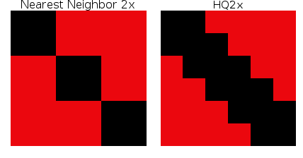

# テクスチャフィルタリング

テクスチャフィルタリングとは、3Dモデルのテクスチャーを滑らかにするための手法のことです。

テクスチャフィルタリングは、NINTENDO64以降のすべての家庭用ゲーム機に搭載されているほか、最近のPCやAndroid端末にも搭載されています。

そのため、エミュレーションの際にも便利で、様々なエミュレータで対応することにより、もともと搭載されていないゲーム機のエミュレータにも適用することができます。

## テクスチャフィルタリング の種類

種類 | 日本語名 | 詳細 | Pros | Cons 
-- | -- | -- | -- | --
Nearest neighbor | 最近傍法 | この方法では、指定した解像度で画像を表示するために、ピクセルを元の解像度での配置に関連する最も近い場所にソートします。 | 高速。整数値（例えば、正確に2倍または4倍の解像度）では、実質的に「フィルタリングなし」です。 | フィルタリングされていないピクセルは、あるものは他のものよりも太く、奇妙に見える傾向があります。その結果、ピクセルアートが鮮明でなくなったり、テキストが読みづらくなったりします。
Bilinear | バイリニア | この線形フィルタリング法は、近傍テクスチャの画素の色データを使用し、複数ビットの色データを組み合わせて、一部の画素を平均化した色に置き換えることで、色が急に変わるのではなく、徐々に切り替わるようにしています。 | 3DゲームはNearest Neighborより良い結果が得られることが多いです。テクスチャのフィルタリング/スケーリングの中では、最もシステム負荷の少ない方法です。 | 低解像度では、2Dゲームが非常にぼやけやすくなります。これは特に2Dゲームや低解像度の3Dゲームで顕著です。ハードウェアがあれば、より複雑なフィルタリング方法で透明度を保つこともできます。
Trilinear | トリリニア | この線形フィルタリング法は、Bilinearフィルタリングと同じことを行いますが、2回通過することで、より滑らかなグラデーションを得ることができます。 | 3Dゲームではバイリニアフィルタリングよりも良さそうです。 | バイリニアと同様に、低解像度のゲームでは、この方法ではぼやけて見えることが多いです。
HQx | -- | テクスチャスケーリングアルゴリズム。テクスチャの直近のバージョンをスケールアップし、ギャップをそのギャップの隣のピクセルのコピーで埋めます。 | 本質的には破壊的なフィルターですが、ゲームによっては（例：Yoshi's Island）、このフィルターを使うことで、アニメのような外観を維持することができます。 | Artifactがよく起きます。45°以外のカーブやスロープは、他のものと比べてギザギザに見えます。テクスチャやスプライトの細かい部分は、エッジ検出が悪いと見えなくなってしまうことがあります。ポスタリゼーションは非常によく起きますが、しかし、いくつかのエミュレータ（PPSSPPなど）には、この問題を解決するためのデポスタリゼーションフィルタがあります。xBRが得意とするものをより苦手とします。
2xSaI | -- | テクスチャースケーリングアルゴリズムです。テクスチャをスケーリングし、ソースから取得したピクセルとランダムに推測した色の混合物でエッジを埋めます。 | HQxやxBRよりもシステム負荷が低く、利用可能な最良のオプションであれば十分です。 | すでに古いアルゴリズムなので別のアルゴリズムを使ってください。エッジ検出は大の苦手です。 ArtifactとPosterizationがよく起きます。
xBR | -- | HQxの改良版です。エッジの検出が良くなり、曲線や45度以上/以下の傾斜の場合に効果があります。 | 2Dゲームが得意です。エッジ検出機能がHQxよりも向上しています。これにより、テクスチャのカーブやスロープがより滑らかになり、アーチファクトも少なくなりました。3Dゲームもきれいに見えます。 | 省略  
xBRZ | -- | xBRを改良したもので、10ピクセル以下の小さなフィーチャーのスケールアップに優れている点を除けば、非常によく似ています。 | 2Dゲームが得意です。HQxやxBRで台無しになってしまう小さな特徴を検出します。3Dゲームもきれいに見えますよ。 | 省略   

## Durante's Hybrid and Deposterization Filters for PPSSPP

PPSSPPには「ハイブリッド」と呼ばれるスケーリングオプションがあります。また、Deposterizeというオプションもあります。

ポスタリゼーションとは、あるピクセルから別のピクセルへの色相の急激なコントラストを意味し（低品質のGIFでは非常によく見られます）、長い間、テクスチャースケーリングアルゴリズムを悩ませてきた問題です。

Durante氏のフィルタは、テクスチャ情報に応じて、xBRフィルタリングとバイリニア/バイキュービックフィルタリングを切り替える。

その上、Deposterizeオプションは、圧縮されたテクスチャのポスタリゼーションエッジに取り組み、シャープな移行ではなく、滑らかなグラデーションを可能にしています。

完璧ではありませんが（完璧なスケーラーは、残念ながら現在のコンピューティングパワーでは不可能です）、それでも素晴らしいものであり、スペックがあればPPSSPPに使用することをお勧めします。

