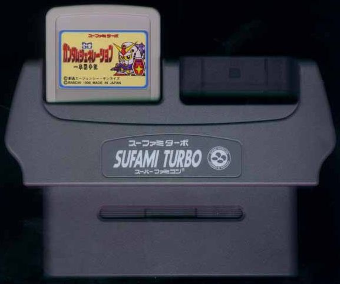
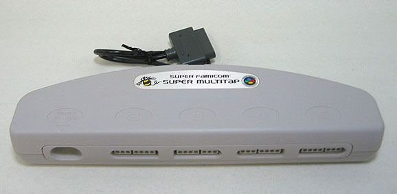
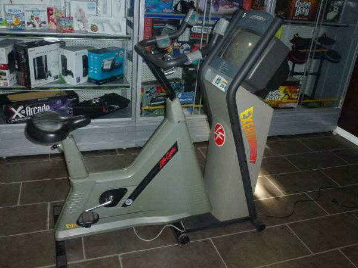
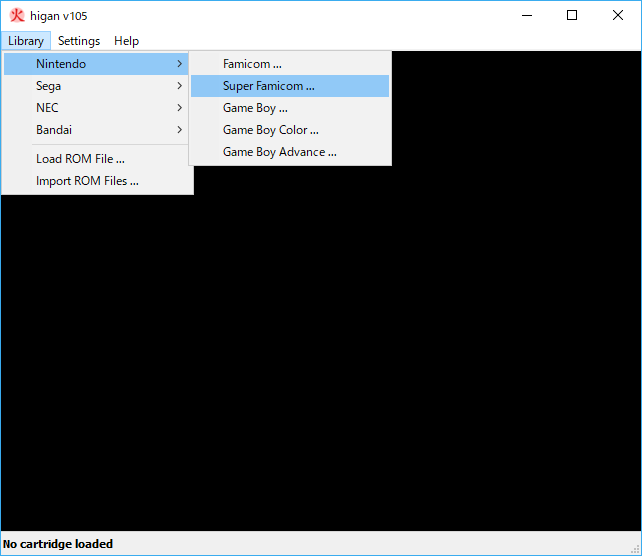
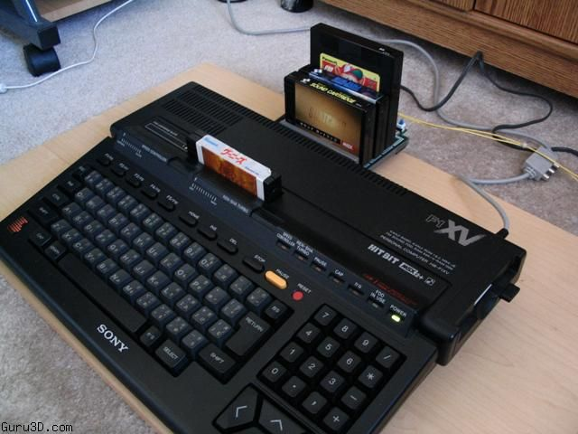
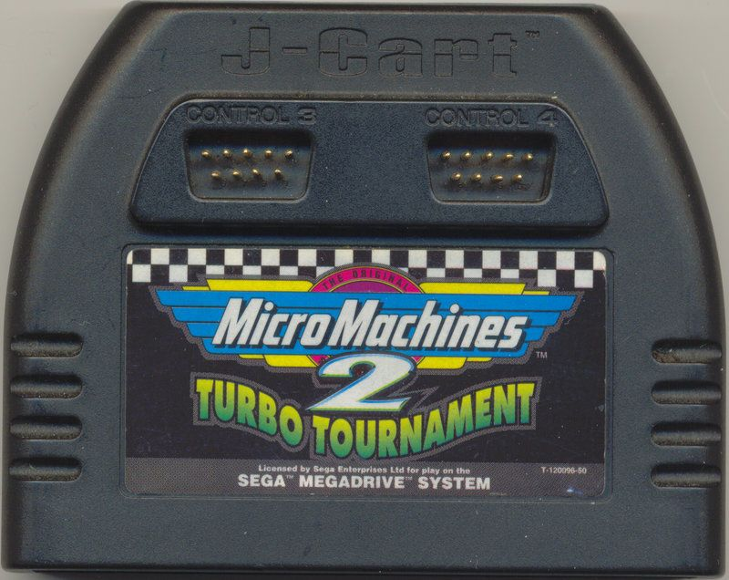
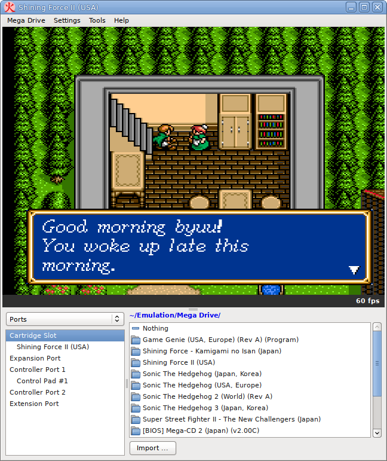
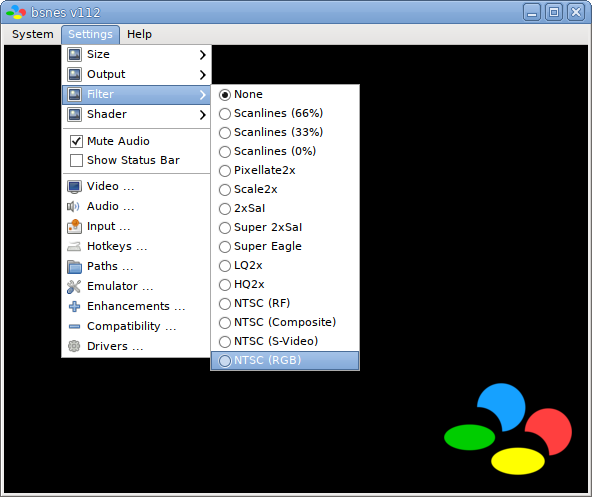

# 階層構造

よくできたエミュレータ、特にマルチシステムエミュレータで最も重要な点の一つは、システム全体の状態を把握するためのしっかりとした階層設計です。

つまり、システムの能力、変更可能な設定、接続可能な外部周辺機器（カートリッジ、フロッピーディスク、コントローラなど）などを表現します。

やみくもにやってもエミュレータは動作しますが、大きなコードベースを後からよりよいデザインに変更するよりも、エミュレータの設計をあらかじめしっかり考えておく方が得策です。

優れた階層設計があれば、エミュレータのコアをGUIから見て抽象化することができますし、他にも多くの利点があります。例えば、複数のバックエンド（例えば異なるオペレーティングシステム用）を提供できるだけでなく、エミュレータ開発から撤退した後も、コアのコードはよりクリーンで抽象化されており、よりポータブルなものになります。

より多くのシステムを簡単にエミュレートすることができ、それらは既存のユーザーインターフェイスにそのままプラグインすることができます。

これらの詳細をハードコーディングする以外に、エミュレータ階層を構造化するには、リストとツリーという2つの主要な方法があります。

## 背景

階層化が必要な第一の理由は、システムの状態が静的ではないからです。

スーパーファミコンには、カートリッジポート、拡張ポート、そして2つのコントローラポートがあると説明することができます。

しかし、[スーファミターボ](https://ja.wikipedia.org/wiki/%E3%82%B9%E3%83%BC%E3%83%95%E3%82%A1%E3%83%9F%E3%82%BF%E3%83%BC%E3%83%9C)のアダプターを見てみましょう。



スーファミターボは、バンダイから発売された機器で、製造コストの低い小型のスーファミターボゲームを遊ぶことができます。

また、友人が持っているゲームを隣に接続すると、2つのゲームが合体してさらに大きなゲームになるというユニークな仕掛けもありました。

例えば、『SDウルトラマン』を合体させると、それぞれのゲームに登場するファイターが加わって1つのゲームになります。『ぽいぽい忍者ワールド』を2本組み合わせれば、それぞれのプレイヤーが保存しているキャラクターデータを使って協力プレイが可能になります。

このカートリッジをスーファミのカートリッジポートに接続すると、面白いことに、スーファミターボのカートリッジポートが2つ追加され、システムの階層が広がったことになります。

次はスーファミのスーパーマルチタップについてみていきましょう。



このデバイスをコントローラポートに接続することで、システムの階層はさらに4つのコントローラポートで拡張され、あらゆる種類のコントローラを受け入れることができます。

もちろん、特定のコントローラーにしか対応していないので、スーパーマルチタップにスーパーマルチタップを連結して16人制のゲームを作ることはできません。しかし、標準的なゲームパッド以外にも対応していました。

## ハードコーディング

ほとんどのスタンドアロンの単一システムのエミュレータは、作業している特定のシステムのUI部分にすべてをハードコーディングするという素朴なアプローチをとっています。

例えば、スーファミのエミュレータなら、従来の『Load Cartridge』というメニューオプションに加えて、『Load Sufami Turbo Cartridge』というメニューを追加したいと思うかもしれません。

また、スーパーゲームボーイに対応する場合は、カートリッジスロットをもう1つ追加します。サテラビューへの対応も同じようにします。他にも対応すべきものが増えた時は同じことをします。

そしてスーパーマルチタップは、標準的なゲームパッドを4本接続したコントローラーのような扱いになります。

しかし、これでは非常に拡張性がなく（ツインタップやその他のコントローラーをスーパーマルチタップに接続したい場合はどうすればいいのでしょうか）、抽象化もされていません。

UI部分はあなたのスーパーファミコンコアを利用することに特化したUIになっていて、ゲームボーイアドバンスのコアを作ったとしてもUI部分は使えないでしょう。

先の例だと『Load Cartridge』というメニューはゲームボーイアドバンスでも使い回せますが、『Load Sufami Turbo Cartridge』というメニューはGBAでは使えません。

しかし、もしあなたが絶対に1つのエミュレータコアしか書きたくないと確信しているのであれば、この方法で非常に親しみやすいUIを多くの作業をせずに作成できることは間違いありません。

## リスト

簡単な改善策は、システムの階層を一連のリストとして表現することです。カートリッジのポート、コントローラーのポート、設定などです。スーパーファミコンの場合、これは次のようになります。

```
- Cartridge Port
- Expansion Port
- Controller Port 1
- Controller Port 2
```

これをAPIで公開すると、次のようになります。

```c++
struct Object { string name; ... };
struct Controller : Object { vector<string> buttons; ... };
struct Setting : Object { vector<string> availableValues; ... };

struct CartridgePort : Object { string fileExtension; ... };
struct ControllerPort : Object { ... };

struct Emulator : Object {
  vector<CartridgePort> cartridgePorts;
  vector<ControllerPort> controllerPorts;
  vector<Controller> availableControllers;
  vector<Setting> settings;
};
struct SuperNintendo : Emulator { ... };

SuperNintendo::SuperNintendo() {
  cartridgePorts.append({...});
  controllerPorts.append({"Controller Port 1", ...});
  controllerPorts.append({"Controller Port 2", ...});
  availableControllers.append({"Gamepad", ...});
  availableControllers.append({"Super Multitap", ...});
  settings.append({"CPU Revision", {"1", "2"}});
}
```

これで、オブジェクト`Emulator`の内部リストを繰り返し処理することで、渡されたエミュレータオブジェクトに基づいて自分自身を構築するユーザーインターフェースを構築できるようになりました。

例えば、露出している各カートリッジポートにゲームをロードするためのメニュー項目を作成したり（SNESには1つしかありませんが、MSXとNintendo DSには2つあります）、各コントローラポート（あれば）にメニューグループを作成して、`availableControllers`で定義した利用可能なコントローラリストから各コントローラタイプを1つずつ入力したりすることができます。

スーファミターボのカートリッジがカートリッジポートにロードされると、エミュレーションコアはスーファミターボのカートリッジスロットごとにカートリッジポートリスト`cartridgePorts`に2つのアイテムを追加します。

ユーザーインターフェースは、エミュレータオブジェクトを再スキャンして、スーファミターボの2つのカートリッジスロットにゲームをロードするための2つの新しいメニューオプションを表示するように再構成する必要があります。

同様に、ゲームをアンロードする際には、この2つのカートリッジポートは消え、ユーザーインターフェースはゲームロードメニューからそれらを削除します。

スーパーマルチタップでも、コントローラーのポートを増やすことで同様の状況になります。

ここで問題があります。スーファミターボのスロットが、現在接続されているベースのスーパーファミコンカートリッジの子孫であることも、追加のコントローラーポートのスロットがスーパースーパーマルチタップの子孫であることも、まったく明らかではないのです。

また、上記では拡張ポートをAPIとして公開していなかったので、かなり面倒なことになっています。

拡張ポートとは何でしょうか？ それはシステムによります。セガCDのようにCD-ROMドライブかもしれませんし、メガドライブのように3つ目のコントローラーになるかもしれません。MSXのように1つのポートがハードウェアの拡張とゲームの両方に使われることもあります。スーパーファミコンの『[エクサテインメント・バイク](https://snescentral.com/article.php?id=0793)』のように、エクササイズバイクにもなりえます。



このように拡張ポートに繋がったデバイスを分類してやる必要があるのです。

## ツリー

完全な階層を表現するには、ツリーを使うのが正しい方法です。

必要なオブジェクトの種類をハードコードしたリストではなく、エミュレートするシステムを表すツリーのルートから始めて、カートリッジポート、拡張ポート、コントローラポート、調整可能な設定、ビデオ出力、オーディオ出力などをツリーのブランチとして表現します。

これらの枝は、成長して自分の枝を含むようになったり、木の葉として終了したりします。スーパーファミコンの場合、この木は次のようになります。

```
- Super Nintendo
    - Cartridge Port => Sufami Turbo
        - Sufami Turbo Port - A
        - Sufami Turbo Port - B
    - Expansion Port
    - Controller Port 1 => Gamepad
    - Controller Port 2 => Super Multitap
        - Super Multitap Port - A => Twin Tap
        - Super Multitap Port - B => Twin Tap
        - Super Multitap Port - C
        - Super Multitap Port - D
    - CPU
        - Revision => 2
```

そのため上の例では、スーファミターボとスーパーマルチタップを接続すると、ツリーが拡大していく様子がわかります。

ツリーの内部構造は以下のようになります。

```c++
struct Object { string name; vector<shared_ptr<Object>> children; ... };
struct SuperNintendo : Object { ... };

struct Peripheral : Object { string type; ... };
struct Cartridge : Peripheral { ... };
struct Expansion : Peripheral { ... };
struct Controller : Peripheral { ... };
```

新しくエミュレートされたシステムに新しいタイプのオブジェクトが必要になった場合、それを追加することができます。

ユーザーインターフェースも新しいタイプのオブジェクトに対応するように拡張する必要がありますが、既存のコードはすべて継続して動作します。

## 抽象化

もうお分かりかもしれませんが、ツリーを構成するためには、すべてのノードが同じ型でなければなりません。つまり、すべてが`Object`を継承しているのです。リストの例では、利便性のためだけに継承しましたが、ツリーでは必要です。

必要ではありませんが、便利なのは、`shared_ptr`を使って、子オブジェクトを参照カウントするようにしたことです。

これにより、ユーザーインターフェースは、ダングリングポインタを恐れることなく、ツリー要素のコピーを保持することができます。慎重に使わないと危険ですが、常にツリー全体を反復する必要がなくなるので、ユーザーインターフェイスのデザインがシンプルになります。これはあなた次第です。

もちろん、次のようにオブジェクトを抽象化して、リストベースのデザインを実装することもできます。

```c++
struct Object { string name; ... };
struct Emulator : Object { vector<Object> objects; ... };
struct SuperNintendo : Emulator { ... };
```

しかし、現時点では、子孫を表現するためにツリー型を使用しない理由はありません。カートリッジポート、コントローラポート、コントローラなどの種類ごとに複数のリストを用意する理由は、すべてをハードコーディングすることと、100%完全に抽象化されたデザインを必要とすることの中間に位置するからです。

しかし、私が説明したような中間的なリスト階層の問題点は、いくつかのシステムでは機能しますが、より多くのシステムをエミュレートするようになると、自重で崩れ始めることです。少なくとも、1つのシステムでしか機能しないようなハードコードされたデザインよりは回復力があります。しかし、最終的には強固な基盤とは言えないと感じています。

## 歴史

注：この部分は、一般的なアドバイスから歴史の授業へと移行する部分です。警告しておきますね。

上記の3つの階層構造は、過去15年間にエミュレータを書いてきた私自身の個人的な経験から生まれたものです。

私は2004年に、ハードコーディングによりスーファミターボとBS-Xサテラビューのサポートをしてbsnesを公開しました。

長い年月を経て、私はUIの設計に飽き飽きしていました。

bsnesはいくつも設計上の問題点を抱えており、人気のあるツールキットを使ってインターフェースを構築していましたが、そのツールキットは非常に大規模で、（少なくとも2010年の時点では）恐ろしくバグが多いことが判明し、問題の解決にはなりませんでした。

私は当初、ユーザーインターフェースの開発を他の開発者に委ねたいと考えていたため、エミュレーションコアとユーザーインターフェースを分離するために、bsnes用のAPIレイヤーを構築する必要がありました。

そして、これを使って、libsnesという上記のようなリストベースの設計のAPIを持ったコアを作りました。

Themaister氏は、libsnesを引き継いで、libsnesをコア部分とした独自のUIを作り、それをSSNESと呼びました。

しかし、スーファミ用に設計されたAPIでは限界があります。このことに気づいたのは、ゲームボーイのエミュレータを前提としたスーパーゲームボーイのエミュレーションに取り組み始めた頃でした。

Themaister氏はSnes9Xをlibsnesに移植することから始め、その後、私とシステムは違うが、SNES以外の他のエミュレータを同じAPIに移植するという、非常に運命的なことをしました。

このあたりから方法論が分かれてきました。Themaister氏は、より多くのシステムをサポートするためにCベースのAPIとしてlibsnesを拡張し、このAPIは最終的にlibretroに改名され、SSNESを動かし、Retroarchと改名されました。

一方、私の方では、libsnesを完全に破棄して、C++によるオブジェクト指向のデザインに移行し、`Emulator::Interface`と名付けました。そして、bsnesはエミュレートされたシステムを増やしながら拡張を続け、Higanとなりました。



libretroと`Emulator::Interface`の間には基本的な違いはなく、一時的には両者の間に翻訳層が存在していたくらいです。

分裂の理由は、私が自分のエミュレータを維持したいと思ったことと、Themaister氏が複数のプロジェクトのエミュレータを取り込みたいと思ったことです。

`Emulator::Interface`の下でhiganはどんどん広がっていきましたが、MSXのエミュレーションを試みるという致命的なミスを犯してしまいました。



一見シンプルな80年代のZ80ベースのコンピューターが、higanの変化の先駆けとなったのです。

MSXは、日本では多くのメーカーが汎用的なパソコンを作っていたときに生まれたものの一つでした。

そして、それぞれのメーカーは、このシステムを独自のセールスポイントとして、幻想的とも言えるような無数の方法で拡張していきました。

私のリストベースのデザインでは、複数のゲームスロットを持つシステムは考えられませんでした。しかし、このMSXは、カートリッジポート、フロッピーディスクドライブ、クイックディスクドライブ、さらにはカセットテープリーダーをいくつでも搭載することができるようになっていました。

上の写真は、側面に2つのカートリッジポートとフロッピーディスクドライブを備えたシステムです。背面の拡張ポートからは、カートリッジを3本追加できるアダプターが接続されていました。

一方、他のコアにも限界が見えてきました。スーファミのエミュレーションコアでは、スーファミターボ、BS-Xサテラビュー、スーパーゲームボーイに対応するために、ベースカートリッジをセットして、エミュレーションコアがユーザーインターフェースにスロット付きのカートリッジ（スーファミターボの場合は2つ）をセットするように要求するという粗いデイジーチェーンハックを思いつきました。

カートリッジポートを追加するシステムは考えていなかったので、スーパーマルチタップはゲームパッドを4つ並べるようにハードコーディングしてしまい、ツインタップのエミュレーションができませんでした。

しかし、メガドライブの「マイクロマシン2」が登場して、私の考えは覆されました。このゲームは、スーパーマルチタップのアダプターを売ろうとするのではなく、カートリッジ自体にポートを追加したのです。



higan v106までの間、私はリストベースのデザインの限界を回避しようとしていましたが、最終的には、これらの様々なシステムや周辺機器を扱うことができる新しい設計が必要であることが明らかになりました。

問題は、libsnesも`Emulator::Interface`も、私がこの記事で説明したリストベースの設計の真の姿ではなかったということです。

メガドライブには、1つのカートリッジポート、1つの拡張スロット、1つの拡張コントロール端子、そして2つのコントローラポートがありました。

ユーザーインターフェースは、ゲームカートリッジがコントローラーポートを増やすことに対応できませんでした。

マイクロマシン2のようなケースに対応できる可能性があるのは、上記のリストベースのシステムだと説明しましたが、ありとあらゆるケースに対応するにはどうしたらいいのか、何ヶ月もかけて考えた結果、私が出した答えはツリーベースのデザインであり、それをhigan v107以降に実装しました。ダイナミックに表現するのであれば、リストではなくツリーで表現した方が、コントローラポート3と4がカートリッジから出ていることが明確になると考えたのです。

higan v106のように、コントローラのポートごとにメニューを表示していたのでは、この階層性を伝えることができませんので、このツリービューを中心にデザインされた新しいユーザーインターフェースが必要でした。

いくつかの新しいエミュレーションコアの追加と、特に新しいツリーベースのデザインのために、higan v106からv107まで2年以上かかりました。その結果がこれです。



そのため、どんな設定でも表現できるようになりましたが、その反面、ユーザーインターフェースが非常に不自然で、慣れるのに時間がかかるようになってしまいました。

計画の初期段階でそうなることは分かっていたので、伝統的なエミュレータのユーザーインターフェースでデザインされたスタンドアロンのSNESエミュレータとしてbsnesを復活させることにしました。



現在のbsnesは、まだ`Emulator::Interface`をベースにしています。これはリストベースのデザインですが、スロット付きカートリッジやスーパーマルチタップに関しては、前述のようにハードコードされた要素があります。

## 終わりに

最終的にどのような設計に仕上げるかはあなた次第です。念の為言っておきますが、この記事では、あるアプローチが他よりも優れているという主張をしているわけではありません。

Snes9Xはハードコーディングされていても例外的にうまくいっていますし、Retroarchは疑似リストベースのアプローチで非常に人気があります。higanは個人的には好きなデザインですが、使いやすさやユーザーの親しみやすさという点では限界があると認識しています。そのため、私もbsnesでは擬似リストベースの手法を使っています。

この記事では、私が認識している設計パラダイムと、個人的に試した設計パラダイムを紹介しましたので、あなたが何を達成したいかに応じて、ご自身で判断していただければと思います。

ただし、よく考えてから始めてください。成熟したエミュレータ、特にhiganのようなマルチシステムのエミュレータでは、階層的なパラダイムを行き来するのは大変な作業です。
