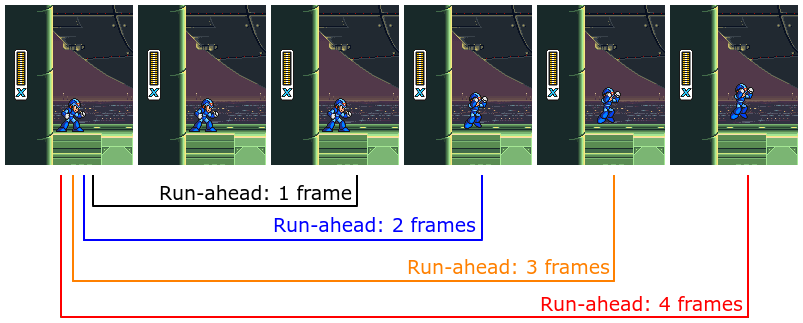
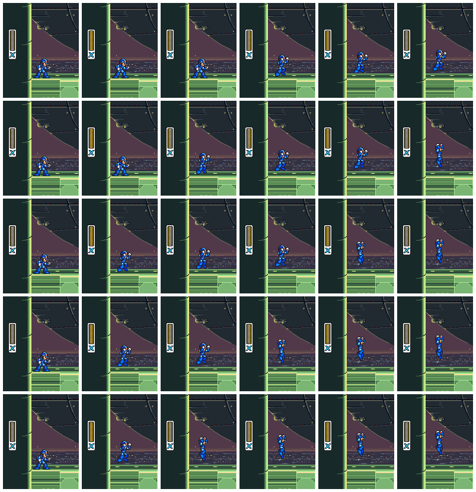
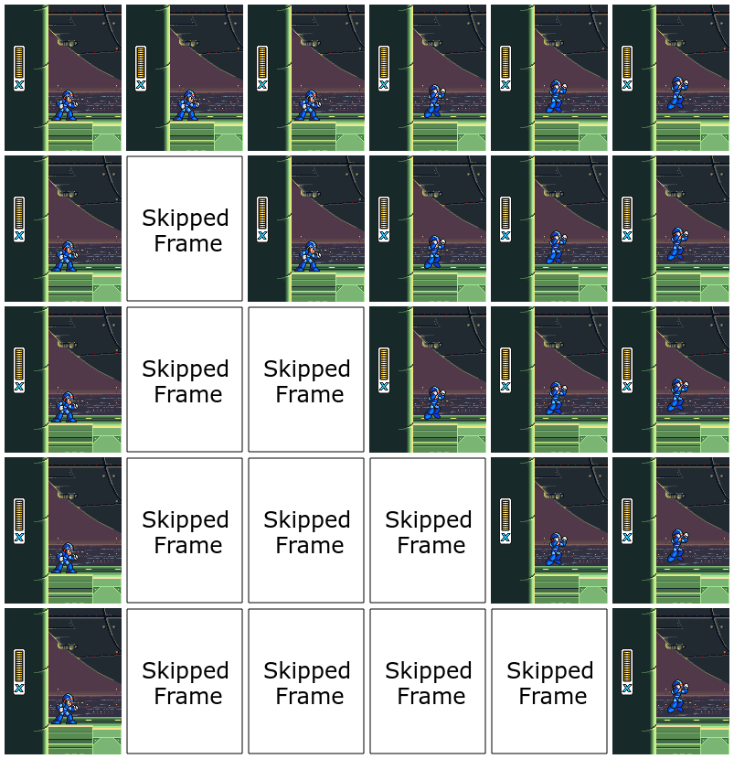
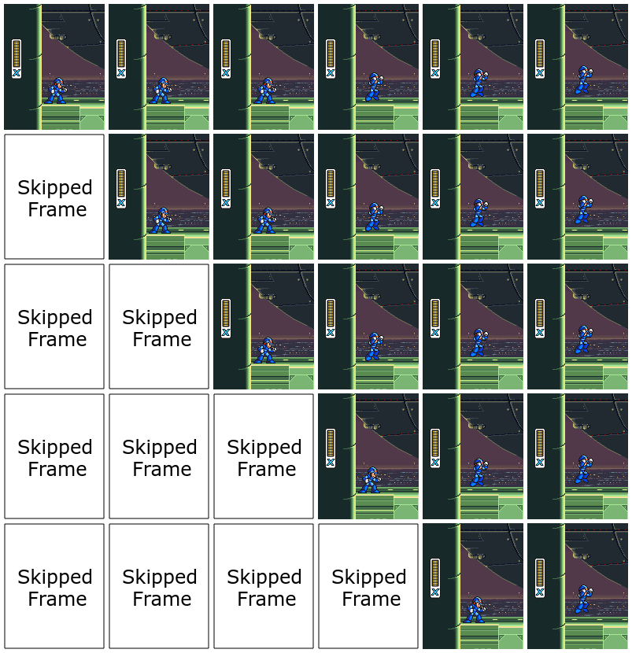

# 先読み

先読み(run-ahead)とは、エミュレートされたビデオゲームの内部処理の遅延を除去するために使用される非常に興味深い技術の名称で、その結果、入力遅延はフレーム全体で減少します。

PCの構成を最適化すれば、PC上で動作するソフトウェア・エミュレータで、ブラウン管TVを使用した実ハードウェアよりも低い遅延を実現することが可能になるのです。

## 概要

ロックマンXをプレイしているときに、ジャンプボタンを押すと、主人公のXが空中に飛び出すとします。遅延のない理想的な状況では、ジャンプボタンを押した瞬間に、Xがジャンプし始めるのを見ることができます。

しかし、実際には、次のような時間が必要になります。


- コントローラをポーリングして、ジャンプボタンが押されていることを確認する
- メモリ上のプレイヤースプライトを更新
- 必要に応じて背景レイヤをスクロールさせる
- アクションが起きたことを知らせるためのサウンドエフェクトの再生
- 新しい位置にプレイヤーを配置した画面を再描画する

ゲームにもよりますが、上記のことは通常、1フレームから4フレームの間で行われます。

この待ち時間の大きな原因は、ゲームがVBlank割り込みの際に、ビデオフレームごとに1回しか入力状態をポーリングしないことにあります。

先読みの目的は、タイムシフトを使ってこれらの待機フレームをスキップすることです。



このように、ロックマンXでは、ジャンプボタンを押してからXがジャンプし始めるまでに3フレーム必要です。

つまり、ユーザーが期待するの3フレーム目が描画されるまでに2フレーム分の内部処理の遅れがあるということです。そのため、先読み設定を1にすると、このうちの1フレームがスキップされ、2にすると、この2つの遅延フレームの両方がスキップされます。

3つ以上のフレームをスキップすると、アニメーションの開始フレームをスキップすることになり、非常に不快なラバーバンド的な視覚効果が発生します。

その理由は、先読みの仕組みを説明したときにわかると思います。

しかし、ここで強調しておきたいのは、ほぼすべてのスーパーファミコンのゲームには、少なくとも1フレームの内部処理の遅れがあり、1の設定(1フレーム分の先読み)は、0.1%程度のライブラリを除いて、すべてのゲームに有効だということです。

先読みの度合いを高くすると互換性がなくなりますが、一般的には1の設定なら体感的にはわかりません。

このように、先読みは、スーファミのほぼ全てのライブラリにおいて、16〜20msの入力遅延を削るためのテクニックです。また、他の多くのシステムでも同じことが言えるでしょう。

## 技術的な説明

前述したように、先読みは時間をずらす技術です。まずは、標準的なエミュレータのランループを見てみましょう。

```c++
void Emulator::runFrame() {
  input.poll();
  auto [videoFrame, audioFrames] = emulator.run();
  video.output(videoFrame);
  audio.output(audioFrames);
}
```

> この入力ポーリング戦略は最適ではありません。入力の遅延を減らすためのJITポーリング手法については、[こちら](latency.md)の記事を参照してください。

先読みを実装した場合、ランループのコードは次のようになります。

```c++
void Emulator::runFrameAhead(unsigned int runAhead) {
  if(runAhead == 0) return runFrame();  //sanity check

  //poll the input states of the controller buttons
  input.poll();
  emulator.run();
  //video and audio frames discarded (not sent to the monitor and speakers)

  //capture the system state so that we can restore it later
  auto saveState = emulator.serialize();

  //we can run-ahead as many frames as we want
  while(runAhead > 1) {
    emulator.run();
    //these frames are also discarded
    runAhead--;
  }

  //here we run the final frame
  auto [videoFrame, audioFrames] = emulator.run();
  //the final frame is rendered
  video.output(videoFrame);
  audio.output(audioFrames);

  //lastly, we restore the save state we saved earlier
  emulator.unserialize(saveState);
}
```

ここでは、先読みが2(フレーム分)だとします。上記のコードでは、コントローラの入力をポーリングして、3フレーム分をエミュレートしています。

その結果、最後の3フレーム目だけが画面に表示されます。

変数`saveState`の目的は、3つのフレームを実行しても、1つのフレームを実行した後に前の状態をロードすることで、標準的な60fps（NTSC）または50fps（PAL）のゲームスピードレートを維持することです。

事実上、`runAhead=2` にしたときの結果は、ゲームパッドのボタンを2フレーム前に押したり離したりしていたらどうなっていたかを示すことになります。

実際、この手法はボタンを押しても離しても機能します。また、常に一定のフレーム数を未来に向けて表示しているため、ゲームの内部処理の遅延フレーム数を超えない限り、映像や音声が乱れることはありません。

内部処理の遅延フレーム数を超えると、アニメーションの冒頭や効果音の開始をスキップするようになり、かなり違和感があります。しかし、繰り返しになりますが、`runAhead=1` の設定は、基本的にほぼすべての場所で動作し、非常に効果的です。

## 実際の例

ここでは、X軸がフレーム（0〜5）、Y軸が先読みフレームの数（0〜4）として、先読みによる効果を示す例をあげます。



一番左のフレーム（#0）がアイドル状態を表していて，そのフレームが描かれた直後にジャンプボタンを押したとします。先読みを0に設定した場合（つまり先読みを使用しない場合）、Xがジャンプを開始するのは3フレーム後であることがわかります。

先読みを1にすると、最初の遅延フレームがスキップされるため、Xはわずか2フレームでジャンプを開始することができます。

先読みを2にすると、内部処理の遅延フレームが両方ともスキップされるため、Xは次のフレームですぐにジャンプを開始することができます。

先読みを3にすると、このゲームの場合、Xのジャンプの最初のアニメーションフレームが失われてしまいます。

先読みを4にすると、最初2つのアニメーションフレームがスキップされます。

したがって、このゲーム(ロックマンX)では、先読みの設定を2にすると、NTSC版でXのジャンプの入力ラグが32ms減少しますが、影響はありません。

## (間違った)可視化例

先ほどとは別の方法でフレームを可視化してみました ...と言いたいですが、これは視覚的に便利になるだけで、技術的には先読みで起こっていることではありません。先読みは、入力状態の遷移だけでなく、常に未来のフレームを実行していることを覚えておいてください。



## 正しい可視化例

実際の先読み時のゲーム映像は次のようになります。



最初のレンダリングフレームでXがすぐにジャンプを開始しないのは、この時点ではコントローラのジャンプボタンが押されていないため、その入力がエミュレートされるように送り返されていないためです。

そのため、上記の修正されたビジュアルデモンストレーションでは、最初のビジュアルフレームではジャンプボタンがリリースされ、それ以降のビジュアルフレームではすべてジャンプボタンが押されています。

## 先読みによるオーバーヘッド

このテクニックは明らかにうまくいっているように見えますが、では何が問題なのでしょうか？

それは主に、オーバーヘッドです。フレーム生成をマルチコアCPUに任せることはできません。なぜなら、各フレームは1つずつ順番にレンダリングされなければならないからです。つまり、シリアルプロセスなのです。

つまり、先読みの設定が1の場合、スーパーファミコンのシステム全体を2回エミュレートしなければなりません。設定が2の場合は3回。そして4の設定では、スーパーファミコンを動かして、5フレーム分の映像・音声データを生成してから、1フレームだけを出力することになります。つまり、先読みを使わずにエミュレータを動かす場合の5倍のオーバーヘッドがあることになります。

このオーバーヘッドを減らすための工夫があります。具体的には、フレームが画面に表示されないため、ビデオ生成のエミュレーションを行う必要がありません。つまり、フレームスキップと同じように扱うのです。ビデオはエミュレーションで最もコストのかかる部分のひとつであることが多いので、これにより先読みのパフォーマンスへの影響を大幅に軽減することができます。bsnesの場合、各フレームの先読みは、100%の追加オーバーヘッドに比べ、約40%の追加オーバーヘッドで済むことになります。

最近のbsnesの最適化により、エントリーレベルのRyzen CPUでも4フレームの先読みを簡単に処理できるようになりましたが、もちろん、エミュレータの要求レベルにもよります。

ちなみに、エミュレータのターボ機能（ゲームの退屈な部分を高速化するためにフレームレートを制限せずに実行する機能）を使用する場合は、エミュレータが最大フレームレートを維持できるように、先読みを無効にする必要があります。

## 対戦型ゲームにおける先読みの使用について

このことは、対戦型ゲームにおける先読みの使用に関して、重要な問題を提起しています。先読みは不正行為なのか？

入力の遅延を減らすことで、熟練したプレイヤーが有利になるのは確かです。

私の考えでは、先読みの使用とスキップするフレーム数が公開され、すべてのプレイヤーの間で一貫している限り、それは公平な競争の場となります。

しかし、これを容認するか、不正行為と見なすかは、他の人の判断に委ねられます。

競争相手のいない一人でのプレイに関しては、それが問題になることはないと思いますが、もちろん人それぞれです。先読みは、エミュレーションの入力遅延を減らすことに興味がある人にとって、強力な選択肢のひとつに過ぎません。

