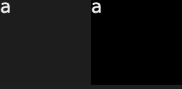
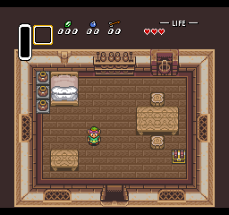
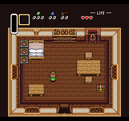
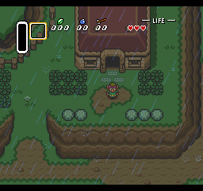
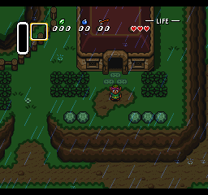
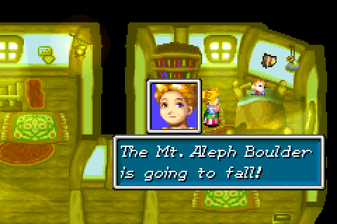
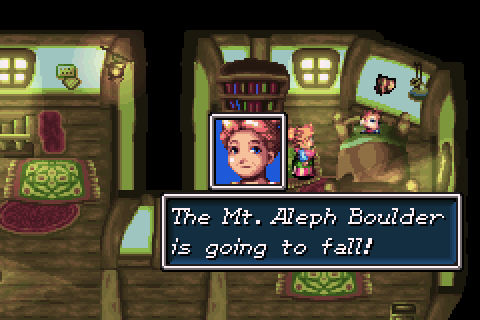
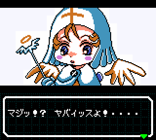
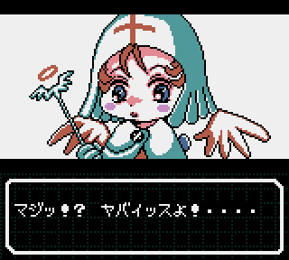

# 色調エミュレーション

ほとんどのレトロゲーム機は、何らかの形でRGBエンコーディングにより色を生成しています。

しかし、生のピクセルカラーは、エミュレータが動作する画面とは全く異なる画面用に設計されていることが多いのです。この記事では、カラーエミュレーションの重要性を説明し、コードとスクリーンショットの例を紹介します。

最近のディスプレイは、液晶(LCD)パネルが主流です。これらは画面の後ろに光源があるため黒色の表現が非常に悪いことで知られています。液晶にはTN、PVA、IPSなどの種類がありますが、ここではそれらの違いはあまり関係ありません。

マニアの間ではブラウン管が使われることもありますし、スマホやタブレットを中心に有機ELディスプレイも徐々に普及してきました。

この記事では、主に液晶(LCD)に焦点を当てたテクニックを説明しますが、このテクニックはすべてのディスプレイタイプに重要です。

## 色精度

まず第一に、ほとんどのコンピュータ向けのモニターは24bitカラーモードで動作します。

つまり、赤(R)、緑(G)、青(B)の各チャンネルに8bit(0から255)の色空間が与えられています。例えば、R,G,Bを255(0xFF)にすると白(0xFFFFFF)を表現します。

しかし、古いゲーム機の多くは、そのような精度で色を指定していません。

例えば、セガサターンは9bitカラーで、1チャンネルあたり3bitでエンコードされています。

これを24bitカラーに直すにはさまざまな方法があります。

最も素朴なエミュレータであれば、3bitを出力の上位3bitに配置し、下位5bitをクリアにしてしまうかもしれませんが、そうすると白が少しグレーになってしまいます。

例:

```
000 000 000 -> 000'00000 000'00000 000'00000
111 111 111 -> 111'00000 111'00000 111'00000
```


逆に、下位5bitを全部1にすると、黒の場合は、少し明るくなってしまいます。

例:

```
000 000 000 -> 000'11111 000'11111 000'11111
111 111 111 -> 111'11111 111'11111 111'11111
```



これを解決するには、ソースビット(元の3bit)がターゲットビットのすべてを埋めるように繰り返す必要があります。

例:

```
000 -> 000 000 00...
010 -> 010 010 01...
011 -> 011 011 01...
111 -> 111 111 11...
```

コードで表すと

```c++
  uint8 red = (r << 5) | (r << 2 )| (r >> 1); // rrr00000 | 000rrr00 | 000000rr -> rrrrrrrr
```

## 画面のエミュレーション

レトロゲーム機は、現代のPC用液晶モニターで動作するようには設計されていません。

一般的に昔の家庭用ゲーム機はブラウン管TV(CRT)用に設計されています。ゲームボーイアドバンスなどの携帯型ゲーム機は現代のものよりかなり性能の悪い液晶パネルを使用しています。

画面の曲がり具合、スキャンライン、カラーブリード、フレーム間ブレンディング、アパーチャグリルなど、特定の画面のアーティファクトをエミュレートすることは、この記事の範囲外です。

### PC用液晶モニター

既存のモニターは、SRGBのような標準に合わせて専門的にキャリブレーションされているものは少ないので、色の範囲はかなり広いのですが、一般的には、適切にキャリブレーションされたSRGBモニターを使用しているかのように色をエミュレートしようとするのが最善の方法だと思います。

### ブラウン管TVのエミュレーション: SNES

ブラウン管TVとPC用液晶モニターの大きな違いは、液晶では黒レベルが大幅に低下している(つまり黒が明るく見える)ことで、これはガンマ曲線を使ってわずかに補正するしかありません。

```c++
//SNES colors are in RGB555 format, so there are 32 levels for each channel
static const uint8 gammaRamp[32] = {
  0x00, 0x01, 0x03, 0x06, 0x0a, 0x0f, 0x15, 0x1c,
  0x24, 0x2d, 0x37, 0x42, 0x4e, 0x5b, 0x69, 0x78,
  0x88, 0x90, 0x98, 0xa0, 0xa8, 0xb0, 0xb8, 0xc0,
  0xc8, 0xd0, 0xd8, 0xe0, 0xe8, 0xf0, 0xf8, 0xff,
};
```

もともと、このテーブルは「Super Sleuth / Kindred」で有名なOverloadのものです。これは、カラーパレットの下半分を暗くし、上半分はそのままにしておくというものです。

左がオリジナル、右が上記のガンマランプを適用したもので、エミュレーションで出力される画像への影響は顕著です。

 

 

### 液晶のエミュレーション: GBA

ゲームボーイアドバンスの液晶画面は、色強度が弱いと色が完全に消えてしまうというひどいものでした。

当時の賢い開発者は、色を大幅に誇張することで、実際のゲームボーイアドバンスの液晶画面でより良い結果を出せることを発見して実践していました。

ただし、GBA用の色強度をそのままPCモニターに持ってくると、彩度が強すぎてしまいます。ありがたいことに、私たちはこれを補正して、むしろ自然な色を出すことができます。

```c++
  double lcdGamma = 4.0, outGamma = 2.2;

  uint R = (rgb555 >>  0) & 0x1F;  // 0..31
  uint G = (rgb555 >>  5) & 0x1F;  // 0..31
  uint B = (rgb555 >> 10) & 0x1F;  // 0..31

  double lr = pow(R / 31.0, lcdGamma);
  double lg = pow(G / 31.0, lcdGamma);
  double lb = pow(B / 31.0, lcdGamma);
  
  double correct_r = pow((  0 * lb +  50 * lg + 255 * lr) / 255, 1 / outGamma) * (255 / 280); // correct_r: 0 ~ 1
  double correct_g = pow(( 30 * lb + 230 * lg +  10 * lr) / 255, 1 / outGamma) * (255 / 280); // correct_g: 0 ~ 1
  double correct_b = pow((220 * lb +  10 * lg +  50 * lr) / 255, 1 / outGamma) * (255 / 280); // correct_b: 0 ~ 1
```

このコードはTalarubi氏の提供によるものです。

左がオリジナル、右が色調補正したものですが、ブラウン管TV(とSNES)の例よりもはるかに劇的な効果が得られています。

 

### 液晶のエミュレーション: GBC

ゲームボーイカラーの画面は意外と色再現性が高いので、色強度をそのままPCモニターに持ってきても少し彩度が強くなる程度で済んでいます。

ゲームボーイカラーのエミュレーターでは、次のようなアルゴリズムがかなり好評です。

```c++
R = (r * 26 + g *  4 + b *  2);
G = (         g * 24 + b *  8);
B = (r *  6 + g *  4 + b * 22);
R = min(960, R) >> 2;
G = min(960, G) >> 2;
B = min(960, B) >> 2;
```

残念ながら、私はこのアルゴリズムを考案した人を知りません。ご存知の方は、ぜひご連絡ください。そうすれば、ここに適切なクレジットを加えることができます

前回同様、左がオリジナル、右が色調補正されたバージョンです。

 

この例を選んだのは、前者の方が鮮やかで好ましいのですが、よく見るとキャラクターのスプライトの周りに市松模様があり、背景よりも明るくなっています。

これは開発者の配慮によるもので、実際のゲームボーイカラーでは、白が洗い流され、2つの異なる色調がほとんど違和感なく混ざり合っています。

## 終わりに

現在、優れた色調補正フィルターを持たないシステムは他にもたくさんあります。微調整が非常に難しいのです。特に、ワンダースワンやネオジオポケットの色を近似させるフィルターは、本稿執筆時点ではありません。

携帯ゲーム機の場合、バックライト（場合によってはフロントライトも）がないことが多く、また、コントラスト比を調整するためのシステム制御があるため、RGBの値に対して真の「色」の値はひとつではありませんから、さらに厄介です。

特に面白いのはワンダースワンカラーで、ソフトウェアでフラグを立てて、画像出力時にコントラストを強くすることができます。これを正確にエミュレートするにはどうしたらいいのか、本当にできるのか、今のところ不明です。

色調エミュレーションはもっと注目されてもいい分野なので、数学や色の分析が得意な方は、ぜひエミュレーションの現場に参加してみてください。
